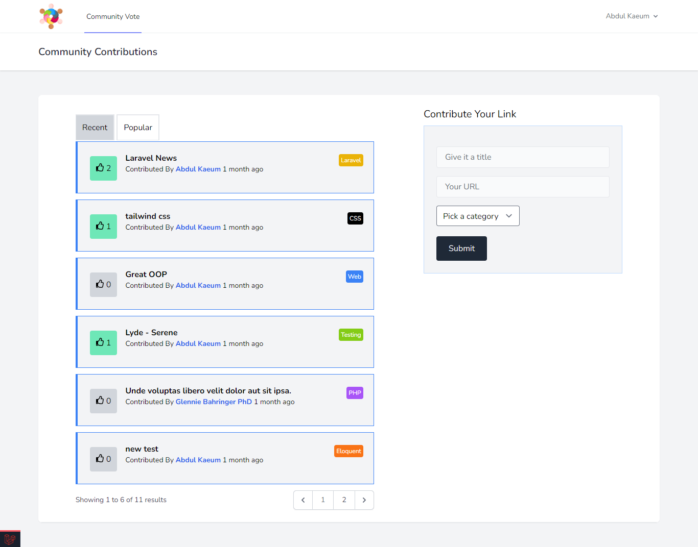

### A Community Contributions application

#### Application features

Allow users to register and post links where other users can then vote up / down 

- Uses the Breeze package for authentication
- Migrations
- Models
- Controllers
- Routes
- Database seeder with faker
- Eloquent relationships + pivot table
- Eloquent local scopes
- Validation
- Model casts
- Pagination + query string

#### Screenshots

